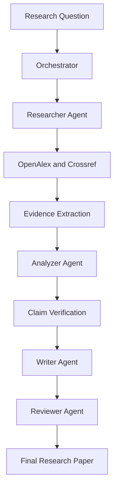

# 🔬 Science Bots — Autonomous AI Research Team

### From Research Questions to Evidence-Grounded Findings

Science Bots is a multi-agent AI research platform that automates the research workflow — from discovering scholarly literature to analyzing evidence, evaluating claims, and generating structured research papers.

Instead of relying on a single AI response, Science Bots coordinates specialized agents to make AI-assisted research more transparent, traceable, and evidence-aware.

🌐 **Live Demo:** [Science Bots](https://effortless-duckanoo-f35f47.netlify.app)  
💻 **GitHub Repository:** [HackathonDuo-Nexora/Science-Bots](https://github.com/HackathonDuo-Nexora/Science-Bots)

---

## ✨ Features

- 🤖 **Multi-Agent Research:** Specialized AI agents collaborate throughout the research process.
- 📚 **Scholarly Literature Search:** Retrieves academic literature using OpenAlex and Crossref.
- 🧠 **AI-Powered Analysis:** Uses Google Gemini to analyze research and synthesize findings.
- 🔎 **Evidence-Based Claim Verification:** Evaluates claims against retrieved sources and available evidence.
- ⚖️ **Honest Verification Status:** Distinguishes supported findings from insufficient or inconclusive evidence.
- 📝 **Automated Research Papers:** Generates structured reports with abstracts, key findings, and citations.
- 🔄 **Reviewer Feedback:** Includes a review stage to improve research-paper consistency.
- 🖥️ **Interactive Research Laboratory:** Visualizes the activity of agents during a research mission.
- ☁️ **Cloud Deployment:** Deployed using Netlify and Render.

## 🏗️ How It Works



### Meet the Agents

| Agent | Responsibility |
|---|---|
| 🎯 Orchestrator | Coordinates the research workflow and agent activities. |
| 📚 Researcher | Searches scholarly literature and collects research sources. |
| 🧠 Analyzer | Examines retrieved information and evaluates claims. |
| ✍️ Writer | Organizes findings into a structured research paper. |
| 🔍 Reviewer | Reviews evidence, claim status, and report consistency. |

## 🛠️ Technology Stack

| Category | Technologies |
|---|---|
| Frontend | React, TypeScript, Vite |
| Backend | Node.js, Express |
| AI Integration | Google Gemini API |
| Research Sources | OpenAlex, Crossref |
| Testing | Node.js test runner, TypeScript checks, Vite build |
| Version Control | Git, GitHub |
| Frontend Hosting | Netlify |
| Backend Hosting | Render |

## 🔬 Evidence Verification

Science Bots is designed to distinguish between a source that is relevant to a topic and evidence that directly supports a claim.

The verification workflow aims to:

1. Filter sources that are unrelated to the research topic.
2. Extract available evidence from retrieved literature.
3. Associate evidence with individual research claims.
4. Evaluate claims using source relevance, evidence availability, and confidence checks.
5. Mark claims with inadequate evidence as **INSUFFICIENT EVIDENCE / UNVERIFIED**, rather than automatically treating them as supported.

The goal is to make research conclusions more transparent and reduce unsupported claims.

> **Research integrity matters:** Automated verification does not guarantee scientific correctness. Sources, citations, and AI-generated conclusions should be independently checked before being used as authoritative findings.

## 🚀 Try the Live Demo

**[Launch Science Bots →](https://effortless-duckanoo-f35f47.netlify.app)**

Example research topics:

- Impact of AI on Future Jobs
- Agentic AI in Medical Diagnosis
- Multi-Agent AI Systems for Scientific Research

Results depend on source availability, external API limits, and AI model availability.

## 💻 Run Locally

### Prerequisites

- Node.js and npm
- A Google Gemini API key
- Git

### 1. Clone the repository

```bash
git clone https://github.com/HackathonDuo-Nexora/Science-Bots.git
cd Science-Bots
```

### 2. Start the backend

```bash
cd Backend
npm install
```

Create a `Backend/.env` file with your own Gemini API key:

```env
GEMINI_API_KEY=your_gemini_api_key
RESEARCH_MODE=real
RESEARCH_FALLBACK_TO_DEMO=false
FRONTEND_URL=http://localhost:5173
```

Start the backend:

```bash
npm run dev
```

### 3. Start the frontend

Open a second terminal from the project root:

```bash
cd Frontend
npm install
```

Create `Frontend/.env`:

```env
VITE_API_URL=http://localhost:3000
```

Start the frontend:

```bash
npm run dev
```

Open the local URL displayed by Vite, usually `http://localhost:5173`.

*If your local backend uses a different port, update the frontend API URL accordingly.*

## 🧪 Testing

The project includes automated tests for research-provider reliability, claim verification, and evidence handling.

Run backend tests from the `Backend` directory:

```bash
node --test
```

Build the frontend from the `Frontend` directory:

```bash
npm run build
```

## 🔐 Security and Limitations

- Keep API keys and credentials in environment variables.
- Never commit `.env` files or publish API secrets.
- Real research mode is configured not to silently substitute demo sources when retrieval fails.
- Academic APIs may enforce rate limits or become temporarily unavailable.
- A relevant source does not necessarily prove a particular claim.
- AI-generated findings may contain errors and require independent verification.

## 🌱 Future Scope

- Stronger semantic evidence evaluation.
- Direct links and passage-level citations for individual claims.
- Improved detection of contradictory research findings.
- Reproducible research trails and expanded export options.
- Additional reliability testing and monitoring.

## 👥 Project

**Science Bots — Autonomous AI Research Team**

Built for experimentation with multi-agent AI, scholarly literature retrieval, evidence verification, and automated research synthesis.

**Repository:** [HackathonDuo-Nexora/Science-Bots](https://github.com/HackathonDuo-Nexora/Science-Bots)

---

*Making AI-assisted research more transparent, traceable, and evidence-aware.*
